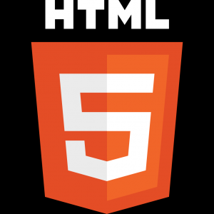

# mickey

Cool guy who likes programming oddly specific QoL stuff. I think Github is a cool place to share my projects, even though nobody is going to use them.
I'm currently working on a (grey-area) cheat for Minecraft -- the Pingspoofer, and am also maintaining the USSR project.

A website is in the works as well, and I'm planning to purchase a domain for it; something like `mick.com` or `mick.xyz`.

Most of my socials (steam, twitch, and spotify is most likely not on my website):

&nbsp;&nbsp;[ladvox](https://www.youtube.com/channel/UCRuBals0-y1L6EOfu5Xw5iw)

&nbsp;&nbsp;[Bunch of Friends](https://www.youtube.com/channel/UCRuBals0-y1L6EOfu5Xw5iw)

&nbsp;&nbsp;[ladvox official](https://discord.gg/Z8UVcEb65u)

&nbsp;&nbsp;[u/mickoissicko](https://www.reddit.com/user/mickoissicko)

&nbsp;&nbsp;[@mickey2449](https://twitter.com/mickey2449)

&nbsp;&nbsp;[oliversvensson](https://open.spotify.com/user/31hktpmjuod3bxq7ixg7vat5tuci)

&nbsp;&nbsp;[mick2449](https://steamcommunity.com/id/mick2449/)

&nbsp;&nbsp;[mickyy_o1](https://www.twitch.tv/mickyy_o1)

## my repositories
[USSR](https://github.com/mickoissicko/ussr)

[Blink](https://github.com/mickoissicko/blink)

[About me](https://github.com/mickoissicko/mickoissicko)

[My website](https://github.com/mickoissicko/website)

[My Github website](https://github.com/mickoissicko/mickoissicko.github.io)

## areas of expertise
I'm pretty good with networking and software -- that's why I programmed the USSR, to help run my Minecraft Server panel 24/7 using Flask.

However, I'm also 'good' at these programming languages.

&nbsp;&nbsp;[Markdown](https://en.wikipedia.org/wiki/Markdown)

&nbsp;&nbsp;[HTML](https://en.wikipedia.org/wiki/HTML)

&nbsp;&nbsp;[JavaScript](https://en.wikipedia.org/wiki/JavaScript)

&nbsp;&nbsp;[CSS](https://en.wikipedia.org/wiki/CSS)

&nbsp;&nbsp;[Python](https://en.wikipedia.org/wiki/Python_(programming_language))

&nbsp;&nbsp;[C](https://en.wikipedia.org/wiki/C_(programming_language))

## projects I'm working on

I'm currently working on these projects, actively maintaining them. If you have a suggestion, please DM me on Discord; my name is ladvox.

[USSR](https://github.com/mickoissicko/ussr)

[My website](https://github.com/mickoissicko/website)

